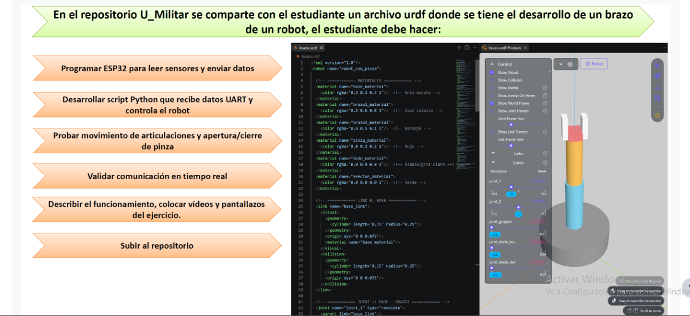
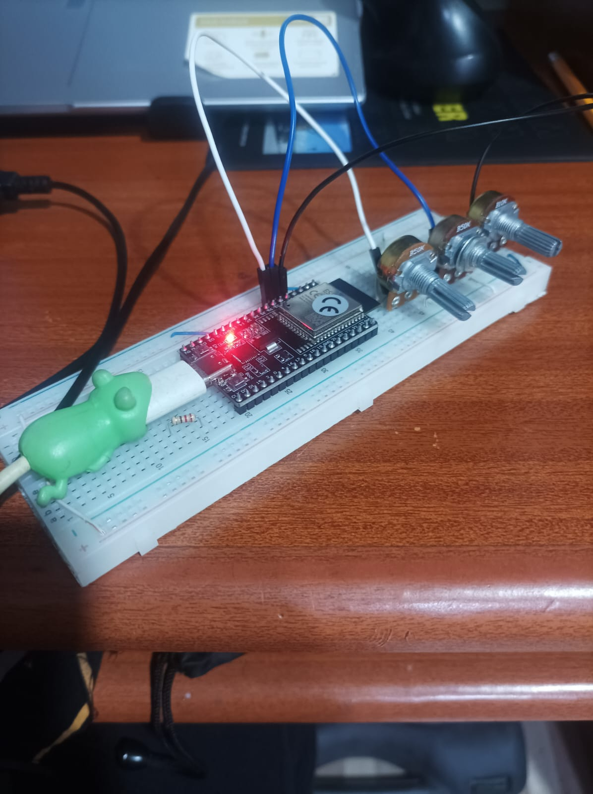
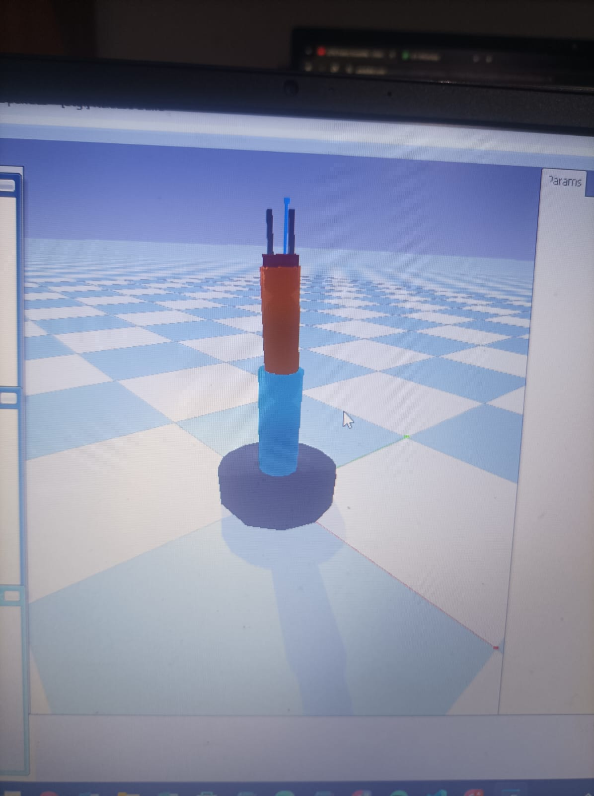

# Actividad 5 – Control de un brazo robótico (URDF) con potenciómetros, ESP32 y PyBullet

**Asignatura:** Micros – Universidad Militar Nueva Granada

Una ESP32 lee tres potenciómetros y envía sus valores por UART a un script de Python, que mueve en tiempo real un brazo robótico con pinza descrito en un archivo URDF y simulado en PyBullet.



## Evidencias

**Video:** [`video/Evidencia3Actividad5Micros.mp4`](video/Evidencia3Actividad5Micros.mp4)

| Montaje (ESP32 + potenciómetros) | Simulación en PyBullet |
|---|---|
|  |  |

## Arquitectura

```
Potenciómetros ──ADC──► ESP32 ──UART (CSV, 115200)──► Python (main.py) ──► PyBullet (brazo.urdf)
```

## Hardware

| Potenciómetro | Pin ESP32 (ADC1) | Articulación controlada | Rango |
|---|---|---|---|
| 10 kΩ | GPIO 34 | `joint_1` (base, giro en Z) | −π a +π rad |
| 50 kΩ | GPIO 35 | `joint_2` (brazo, giro en Y) | −π/2 a +π/2 rad |
| 50 kΩ | GPIO 32 | `joint_gripper` (pinza, prismática) | 0 a 0.03 m |

Cada potenciómetro va con sus extremos a 3.3 V y GND, y el pin central a la entrada analógica.

## Desarrollo

### 1. Modelo del robot (`python/brazo.urdf`)
Robot `robot_con_pinza` con:
- Base cilíndrica fija (gris).
- `joint_1` (revolute, eje Z): brazo 1 azul.
- `joint_2` (revolute, eje Y): brazo 2 naranja.
- Pinza: base roja fija y dos dedos prismáticos. `joint_gripper` mueve el dedo izquierdo en X y `joint_gripper_der` copia su movimiento en sentido opuesto con `<mimic>`.

### 2. Firmware (`firmware/potenciometrosActividad5/`)
- ADC a 12 bits (0–4095) en pines de ADC1.
- Cada lectura se convierte con `map()` a las unidades reales de la articulación (rad o m).
- Envía una línea CSV `j1,j2,gripper` cada 50 ms (~20 Hz), por ejemplo `1.25,-0.40,0.015`.

### 3. Script de Python (`python/main.py`)
- Abre el puerto serial (`PUERTO_SERIAL`, 115200 baudios).
- Inicia PyBullet en modo GUI, carga el plano y `brazo.urdf` con base fija, y lista las articulaciones.
- En el bucle principal avanza la simulación, lee una línea, la separa por comas y valida que tenga 3 valores.
- Aplica cada valor con `setJointMotorControl2` en modo `POSITION_CONTROL` a `joint_1`, `joint_2` y `joint_gripper`.
- Las líneas incompletas o corruptas se ignoran. Se termina con `Ctrl+C`.

## Cómo ejecutarlo

1. Abrir `firmware/potenciometrosActividad5/potenciometrosActividad5.ino` en Arduino IDE y subirlo a la ESP32.
2. Instalar dependencias:
   ```bash
   cd python
   pip install -r requirements.txt
   ```
3. Editar `PUERTO_SERIAL` en `main.py` (por ejemplo `COM5`; en Linux/Mac `/dev/ttyUSB0`).
4. Cerrar el Monitor Serie del Arduino IDE y ejecutar:
   ```bash
   python main.py
   ```
   `brazo.urdf` debe estar en la misma carpeta que `main.py`.

## Estructura del repositorio

```
.
├── README.md
├── docs/
│   ├── enunciado.png
│   ├── montaje.jpg
│   └── simulacion_pybullet.jpg
├── firmware/potenciometrosActividad5/potenciometrosActividad5.ino
├── python/
│   ├── main.py
│   ├── brazo.urdf
│   └── requirements.txt
└── video/Evidencia3Actividad5Micros.mp4
```
